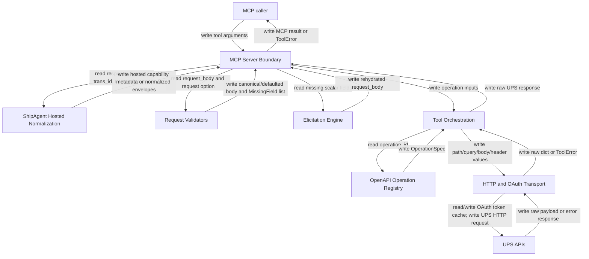

## System Overview
`ups-mcp` is a Python FastMCP stdio server that exposes UPS shipping and logistics tools. The runtime entry point is `ups_mcp.server:main` from `pyproject.toml`, and the active MCP boundary is `ups_mcp/server.py`.

The server has no application database or durable queue. It reads process environment configuration, accepts MCP tool arguments, optionally completes partial shipment/rate request bodies through form-mode elicitation, maps tool calls into UPS OpenAPI operations, obtains OAuth client-credentials tokens, and sends HTTP requests to UPS CIE or production endpoints.

Raw mode is the compatibility path: UPS successes are returned as raw dictionaries, and UPS failures raise `ToolError` payloads. Hosted ShipAgent mode is opt-in only for `rate_shipment`, `validate_address`, and `create_shipment`; it bypasses elicitation, preflights missing fields, normalizes successful UPS payloads, and maps failures into closed safe envelopes.

## Component Inventory
| name | file | responsibility |
| --- | --- | --- |
| MCP Server Boundary | [docs/components/ups-mcp-mcp-server-boundary.md](docs/components/ups-mcp-mcp-server-boundary.md) | Registers the FastMCP tools, owns runtime configuration, raw-vs-hosted branching, correlation validation, elicitation wiring, and server startup. |
| Tool Orchestration | [docs/components/ups-mcp-tool-orchestration.md](docs/components/ups-mcp-tool-orchestration.md) | Maps tool-level arguments into UPS operation IDs, request bodies, path/query parameters, headers, account defaults, and idempotency metadata passthrough. |
| OpenAPI Operation Registry | [docs/components/ups-mcp-openapi-operation-registry.md](docs/components/ups-mcp-openapi-operation-registry.md) | Loads bundled or override OpenAPI specs and converts operation metadata into `OperationSpec` objects used for routing. |
| HTTP and OAuth Transport | [docs/components/ups-mcp-http-oauth-transport.md](docs/components/ups-mcp-http-oauth-transport.md) | Renders operation paths, manages OAuth client-credentials tokens, sends UPS HTTP requests, parses responses, and raises raw `ToolError` failures. |
| Elicitation Engine | [docs/components/ups-mcp-elicitation-engine.md](docs/components/ups-mcp-elicitation-engine.md) | Builds flat form schemas from missing scalar fields, normalizes and validates user answers, rehydrates nested request bodies, and manages retry/decline/cancel flows. |
| Request Validators | [docs/components/ups-mcp-request-validators.md](docs/components/ups-mcp-request-validators.md) | Performs pure create-shipment and rate-shipment canonicalization, defaulting, conditional required-field detection, and rating packaging remapping. |
| ShipAgent Hosted Normalization | [docs/components/ups-mcp-shipagent-hosted-normalization.md](docs/components/ups-mcp-shipagent-hosted-normalization.md) | Builds hosted capability metadata, normalizes hosted rate/address/create successes, and maps raw UPS or transport failures into safe hosted error envelopes. |

## Mermaid diagram

## Per-component summary
### MCP Server Boundary
Read variables: MCP tool arguments, `response_format`, `trans_id`, `transaction_src`, `ctx`, `CLIENT_ID`, `CLIENT_SECRET`, `UPS_ACCOUNT_NUMBER`, `ENVIRONMENT`, `ToolManager`, server package version.

Write variables: FastMCP tool results, raw `ToolError` payloads, generated `corr_<uuid>` correlation IDs, global runtime `base_url`, `client_id`, `client_secret`, `tool_manager`, hosted preflight errors, hosted normalized responses.

Conditional loops: production vs CIE environment selection; raw vs `shipagent_v1`; hosted correlation and transaction source validation; address country support and required-field preflight; rate/create allow-elicitation vs no-elicitation paths; startup spec-load failure handling.

### Tool Orchestration
Read variables: tool arguments, account number defaults, constants for locator/pickup/paperless mappings, `OperationSpec` metadata, UPS request bodies, idempotency keys.

Write variables: `OAuthManager`, `UPSHTTPClient`, UPS JSON request bodies, path params, query params, headers, `TransactionReference.CustomerContext`, outbound operation calls.

Conditional loops: rate request option normalization; request-body type checks; account fallback and required-account checks; commodity and package/document body assembly loops; paperless format validation; locator/pickup/cancel option branching; deprecated operation rejection.

### OpenAPI Operation Registry
Read variables: `UPS_MCP_SPECS_DIR`, bundled `ups_mcp/specs/*.yaml`, OpenAPI paths, methods, parameters, request bodies, deprecation flags.

Write variables: cached `OpenAPIRegistry`, `OperationSpec`, `ParameterSpec`, default path values, load errors for missing required specs.

Conditional loops: override directory vs package resources; required vs optional specs; HTTP method filtering; duplicate `operationId` detection; deprecated operation filtering.

### HTTP and OAuth Transport
Read variables: base URL, OAuth token URL, credentials, token expiry, `OperationSpec`, path params, query params, JSON body, additional headers, UPS HTTP responses.

Write variables: OAuth access token cache and expiry, `Authorization`, `transId`, and `transactionSrc` headers, UPS HTTP requests, parsed success dictionaries, raw-mode `ToolError` details.

Conditional loops: double-checked token freshness; reserved-header protection; path token substitution; JSON vs text response parsing; success status vs error status; nested UPS error code/message extraction.

### Elicitation Engine
Read variables: `MissingField`, `FieldRule`, `ArrayFieldRule`, request body, MCP client elicitation capabilities, accepted/declined/cancelled form results.

Write variables: dynamic Pydantic form models, normalized flat values, validation errors, rehydrated request body copies, structured elicitation `ToolError` payloads.

Conditional loops: structural vs scalar missing fields; form capability checks; retry loop up to `max_retries`; validation retry messages; still-missing field detection; decline/cancel handling.

### Request Validators
Read variables: create-shipment and rate-shipment request bodies, `UPS_ACCOUNT_NUMBER` env config, rule tables, package arrays, payer objects, country codes, service codes, international form types, return-service markers.

Write variables: canonical request body copies, defaulted body copies, `MissingField` lists, `AmbiguousPayerError`, `TypeError` structural failures, rating `PackagingType` API body copies.

Conditional loops: built-in/env/caller default priority; payer ambiguity detection; package iteration; US/CA/PR postal/state requirements; international contact/description/invoice/form rules; UPS Letter and EU-to-EU Standard exemptions; rate shop service-code exemption.

### ShipAgent Hosted Normalization
Read variables: raw UPS rate/address/shipment payloads, request options, correlation IDs, idempotency keys, raw `ToolError` JSON text, HTTP status codes, UPS error codes/messages.

Write variables: hosted capabilities payload, hosted rate quote/shop success payloads, hosted address status/candidates, hosted create-shipment label data, normalization errors, safe error envelopes.

Conditional loops: quote vs shop rate normalization; valid/ambiguous/invalid/unknown address status handling; single-vs-list candidate and package handling; negotiated-vs-standard charge selection; label format and base64 validation; error classification and mutating retryability override.
