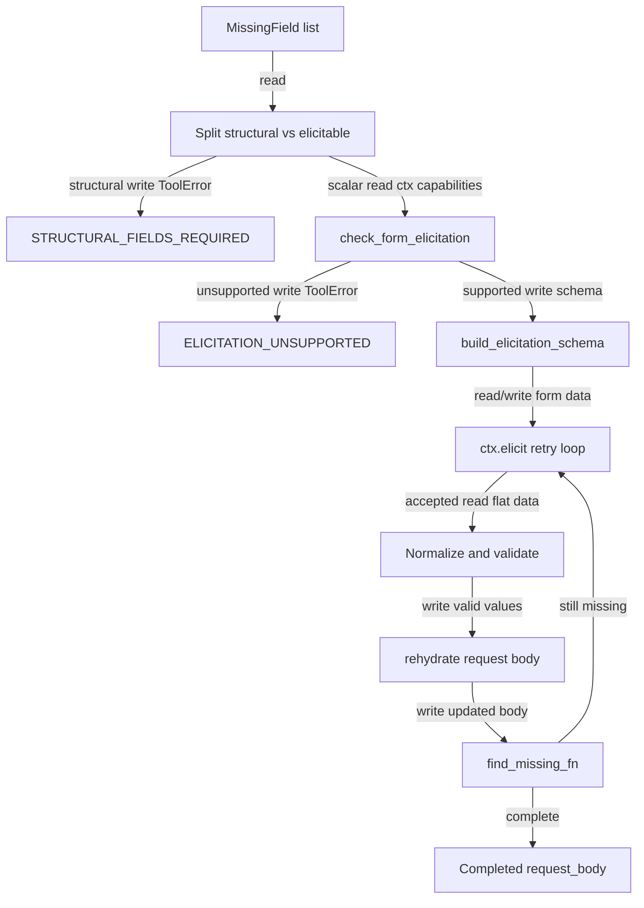

## Responsibility
`ups_mcp/elicitation.py` is the shared MCP form-mode elicitation foundation. Tool-specific validators declare `FieldRule`, `MissingField`, and `ArrayFieldRule` data; this component turns missing scalar fields into a flat Pydantic schema, calls `ctx.elicit()`, normalizes and validates the accepted values, rehydrates them into nested UPS request bodies, and retries when values are invalid or still incomplete.

It deliberately treats structural fields differently from scalar fields. Missing dicts/lists that cannot be collected through a flat form return `STRUCTURAL_FIELDS_REQUIRED` guidance instead of entering form elicitation.

Primary evidence: `ups_mcp/elicitation.py`, `tests/test_elicitation.py`, `tests/test_server_elicitation.py`, and `tests/test_server_rate_elicitation.py`.

## Read Variables
- Rule inputs: `FieldRule`, `MissingField`, and `ArrayFieldRule` instances.
- Nested request bodies and dot paths such as `ShipmentRequest.Shipment.Package[0].PackageWeight.Weight`.
- MCP `Context` client parameters and elicitation capabilities.
- `AcceptedElicitation`, `DeclinedElicitation`, and `CancelledElicitation` results.
- Flat form response data from Pydantic `model_dump()`.
- Validation metadata: enum values/titles, type hints, defaults, constraints, country/state/currency/postal/weight key patterns.

## Write Variables
- Dynamic Pydantic models from `build_elicitation_schema()`.
- Flat normalized value dictionaries from `normalize_elicited_values()`.
- Validation error message lists from `validate_elicited_values()`.
- Rehydrated nested request body copies from `rehydrate()`.
- Reconstructed array items for array rules.
- Structured `ToolError` payloads for unsupported elicitation, structural requirements, failed transport, invalid responses, decline, cancel, and max retries.

## Conditional Loops
- `_field_exists()` walks dot paths and treats `None`, empty strings, and whitespace as missing while preserving meaningful falsy values.
- `_set_field()` creates missing dict/list intermediates but raises `TypeError` when existing structures conflict.
- `expand_array_fields()` inspects existing array length and caps generated fields at `max_items`.
- `build_elicitation_schema()` chooses `Literal`, `float`, `int`, `bool`, or `str` field types and attaches constraints.
- `normalize_elicited_values()` trims values, drops blanks, and uppercases country, state, weight-unit, and currency-code fields.
- `validate_elicited_values()` loops through flat values to enforce enums, positive finite weights, two-letter country/state codes, three-letter currency codes, and US/CA postal formats.
- `check_form_elicitation()` supports explicit form capability and backward-compatible empty elicitation capability.
- `elicit_and_rehydrate()` separates structural from scalar fields, loops up to `max_retries`, retries on validation errors or still-missing scalar fields, and branches on accept/decline/cancel.

## Mermaid (internal flow)

