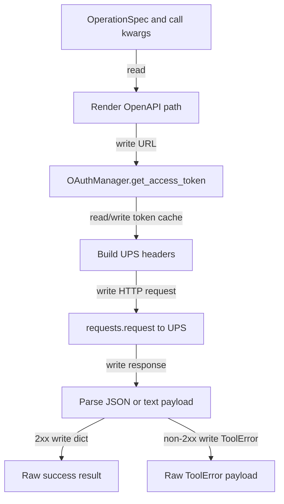

## Responsibility
`ups_mcp/http_client.py` and `ups_mcp/authorization.py` implement the outbound UPS transport boundary. `OAuthManager` obtains and caches OAuth2 client-credentials access tokens. `UPSHTTPClient` renders OpenAPI paths, builds UPS request headers, sends HTTP requests with `requests`, parses response payloads, and converts non-2xx responses into raw-mode `ToolError` JSON.

`ups_mcp/constants.py` supplies the CIE and production base URLs used by the server and transport clients.

Primary evidence: `ups_mcp/http_client.py`, `ups_mcp/authorization.py`, `ups_mcp/constants.py`, `tests/test_http_client.py`, and `tests/test_authorization.py`.

## Read Variables
- Base URLs: `CIE_URL`, `PRODUCTION_URL`, and the selected `base_url`.
- OAuth inputs: token URL, `client_id`, `client_secret`, timeout, cached access token, token expiry.
- `OperationSpec` fields: `method` and path template.
- Path params, query params, JSON body, optional `trans_id`, `transaction_src`, and additional headers.
- UPS HTTP response status, content, JSON body, and text body.

## Write Variables
- Cached OAuth `access_token` and `token_expiry`.
- UPS HTTP request URL under `{base_url}/api{rendered_path}`.
- Request headers: `Authorization`, `transId`, `transactionSrc`, plus non-reserved additional headers.
- Safe query dict with `None` values removed.
- Success return dictionaries, including `{"raw": payload}` when a successful response is not a JSON object.
- Raw-mode `ToolError` JSON with `status_code`, `code`, `message`, and `details`.

## Conditional Loops
- `OAuthManager.get_access_token()` returns a cached token when fresh, otherwise enters a lock and checks freshness again before requesting a new token.
- Missing OAuth credentials raise `ValueError` before requesting a token.
- `_render_openapi_path()` iterates `{token}` placeholders and raises a validation `ToolError` when a path param is missing.
- `UPSHTTPClient.call_operation()` generates a UUID `transId` when none is provided and defaults `transactionSrc` to `ups-mcp`.
- Additional headers are skipped when they conflict with reserved header names.
- `requests.RequestException` is converted into `REQUEST_ERROR` `ToolError`.
- `_parse_payload()` returns JSON, text-as-raw, or `None` depending on response content.
- 2xx responses return parsed payload; non-2xx responses extract a code/message from common UPS envelope shapes before raising.

## Mermaid (internal flow)

