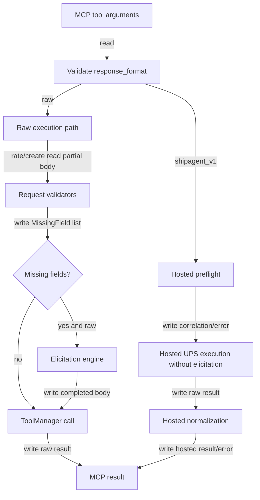

## Responsibility
`ups_mcp/server.py` is the FastMCP boundary for the package. It creates `mcp = FastMCP("ups-mcp")`, registers the read-only `shipagent_capabilities` tool plus UPS operation tools with `@mcp.tool()`, validates runtime configuration, initializes `tools.ToolManager`, and starts stdio transport in `main()`.

This component owns user-visible tool signatures and boundary behavior. It validates `response_format`, chooses raw or hosted behavior for `validate_address`, `rate_shipment`, and `create_shipment`, generates hosted correlation IDs, validates hosted `transaction_src`, validates hosted create-shipment idempotency input, and wires raw create/rate missing-field paths into the elicitation engine.

Primary evidence: `ups_mcp/server.py`, `ups_mcp/__main__.py`, `tests/test_server_tools.py`, `tests/test_server_new_tools.py`, `tests/test_server_config.py`, `tests/test_server_elicitation.py`, `tests/test_server_rate_elicitation.py`, and `tests/test_shipagent_server_hosted.py`.

## Read Variables
- Process environment: `ENVIRONMENT`, `CLIENT_ID`, `CLIENT_SECRET`, `UPS_ACCOUNT_NUMBER`.
- Tool arguments: UPS tool params, raw `request_body`, `requestoption`, `response_format`, `trans_id`, `transaction_src`, `idempotency_key`, and optional MCP `ctx`.
- Runtime globals: `base_url`, `client_id`, `client_secret`, `tool_manager`.
- Hosted contract helpers from `ups_mcp/shipagent_normalization.py`.
- Validator and elicitation functions imported inside `_rate_shipment_execute()` and `_create_shipment_execute()`.
- Installed package version from `importlib.metadata.version("ups-mcp")`.

## Write Variables
- FastMCP tool return values for raw UPS dictionaries and hosted-safe dictionaries.
- Direct raw `ToolError` payloads for invalid `response_format`, malformed structures, missing raw fields, ambiguous payer, and elicitation failures.
- Hosted validation/unknown error dictionaries and generated `corr_<uuid hex>` correlation IDs.
- Runtime globals set by `_refresh_runtime_configuration()` and `_initialize_tool_manager()`.
- Defaulted/canonicalized request bodies passed from server helpers into `ToolManager`.
- Hosted `trans_id` forwarded to UPS as the correlation ID when hosted mode is selected.

## Conditional Loops
- `_refresh_runtime_configuration()` selects production URL only when `ENVIRONMENT == "production"`; otherwise CIE is used.
- `_validate_response_format()` accepts only `raw` and `shipagent_v1`; invalid values raise `ToolError` before UPS execution.
- Hosted correlation handling rejects ASCII control characters, preserves stripped caller IDs, or generates `corr_<uuid>`.
- Hosted `transaction_src` and idempotency keys reject ASCII control characters before UPS execution.
- `validate_address()` returns raw by default, hosted unsupported success for non-US/PR two-letter countries, hosted validation errors for malformed or blank supported fields, or normalized hosted results after UPS execution.
- `rate_shipment()` and `create_shipment()` allow elicitation only in raw mode; hosted mode sets `ctx=None` and returns hosted validation errors for missing fields.
- `_rate_shipment_execute()` and `_create_shipment_execute()` canonicalize, default, find missing fields, optionally elicit, and only then call UPS.
- `main()` exits with status 1 on OpenAPI spec load errors and ignores `KeyboardInterrupt`.

## Mermaid (internal flow)

