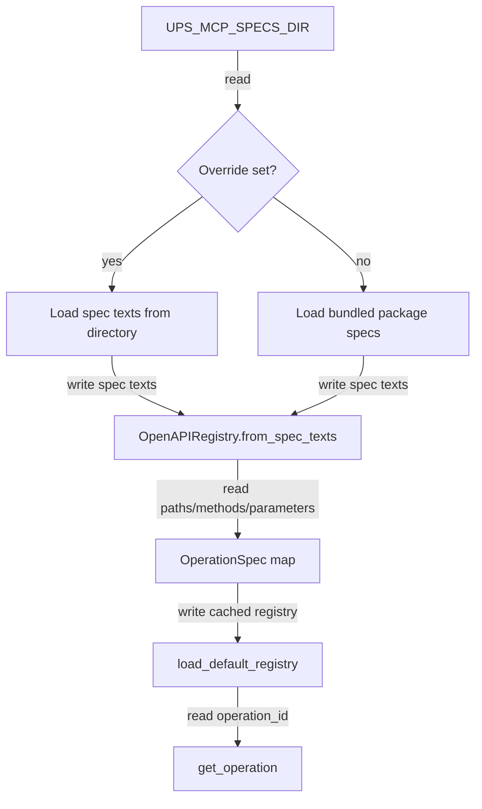

## Responsibility
`ups_mcp/openapi_registry.py` loads UPS OpenAPI specs from either `UPS_MCP_SPECS_DIR` or bundled package resources under `ups_mcp/specs/`. It extracts the operation metadata needed for runtime routing: operation ID, HTTP method, path template, deprecation flag, summary, request-body requirement, and path/query/header parameters.

This component intentionally does not validate UPS request/response schemas. Its interface to the rest of the system is `OpenAPIRegistry.get_operation()` and `OperationSpec.default_path_values()`.

Primary evidence: `ups_mcp/openapi_registry.py`, `ups_mcp/specs/*.yaml`, `tests/test_openapi_registry.py`, and `tests/test_package_data.py`.

## Read Variables
- `UPS_MCP_SPECS_DIR` environment variable.
- Bundled package resources from `resources.files("ups_mcp").joinpath("specs")`.
- Required spec files: `Rating.yaml`, `Shipping.yaml`, `TimeInTransit.yaml`.
- Optional spec files: `LandedCost.yaml`, `Paperless.yaml`, `Locator.yaml`, `Pickup.yaml`.
- YAML `paths`, HTTP methods, `operationId`, `parameters`, `requestBody`, `deprecated`, and `summary` fields.

## Write Variables
- `ParameterSpec` dataclass instances for path, query, and header parameters.
- `OperationSpec` dataclass instances keyed by operation ID.
- `OpenAPIRegistry` instances and cached default registry from `load_default_registry()`.
- `OpenAPISpecLoadError` with source and missing required spec names.
- Default path-value dictionaries derived from parameter schema defaults.

## Conditional Loops
- `default_spec_paths()` reads override specs when `UPS_MCP_SPECS_DIR` is set; otherwise it points at bundled specs.
- `_load_spec_texts_from_dir()` iterates default spec names, raises only for missing required files, and skips missing optional files.
- `_load_spec_texts_from_package()` applies the same required/optional rule for package resources.
- `from_spec_texts()` loops through OpenAPI paths and methods, skipping non-HTTP keys.
- Duplicate `operationId` values raise `ValueError`.
- `list_operations(include_deprecated=False)` filters deprecated operations unless requested.
- `get_operation()` raises `KeyError` when the requested operation is absent.

## Mermaid (internal flow)

