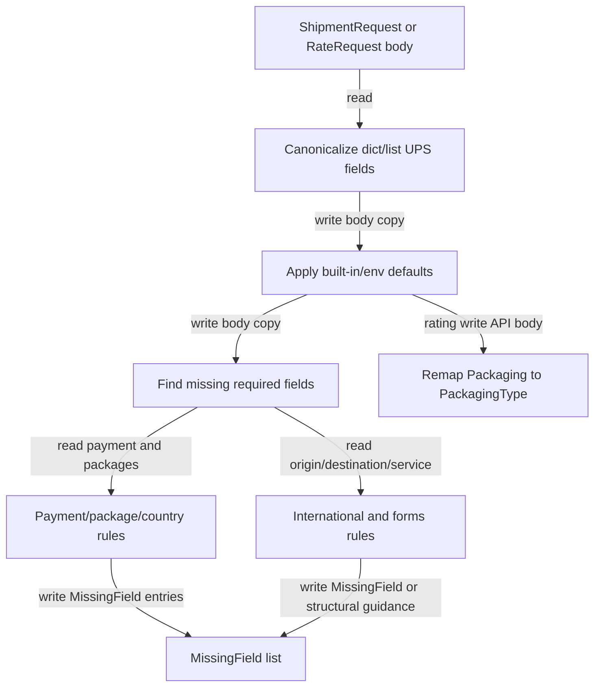

## Responsibility
`ups_mcp/shipment_validator.py` and `ups_mcp/rating_validator.py` are pure validation/defaulting modules for the two complex UPS request bodies that support progressive elicitation. They define required-field rules, canonicalize dict-or-list fields, apply built-in and environment defaults without overwriting caller intent, identify missing fields, and expose the metadata the elicitation engine needs to render typed forms.

`shipment_validator.py` owns create-shipment rules, including domestic, international, InternationalForms, SoldTo, EEI, product-array, and duties/taxes checks. `rating_validator.py` mirrors the shipment pattern for `RateRequest`, reuses shared shipment sub-rules, exempts service code for shop modes, and remaps `Packaging` to `PackagingType` before the UPS Rating API call.

Primary evidence: `ups_mcp/shipment_validator.py`, `ups_mcp/rating_validator.py`, `ups_mcp/constants.py`, `tests/test_shipment_validator.py`, `tests/test_rating_validator.py`, `tests/test_server_elicitation.py`, and `tests/test_server_rate_elicitation.py`.

## Read Variables
- Request bodies rooted at `ShipmentRequest` and `RateRequest`.
- Rule tables: unconditional rules, package rules, payment rules, country-conditional rules, international contact/description/invoice rules, InternationalForms rules, product array rules, SoldTo rules, EEI filing rules, and rating service-code rules.
- Environment config passed as `{"UPS_ACCOUNT_NUMBER": ...}`.
- Existing payer objects: `BillShipper`, `BillReceiver`, and `BillThirdParty`.
- Package arrays, `ShipmentCharge` arrays, country codes, `ShipFrom`, `Shipper`, `ShipTo`, `Service.Code`, `ReturnService`, and InternationalForms `FormType`.
- Constants for EU countries, international form types, forms requiring products/currency, and reason-for-export values.

## Write Variables
- Canonical deep-copy bodies with `Package`, `ShipmentCharge`, and related fields normalized to list form.
- Defaulted deep-copy bodies with `RequestOption`, charge type, shipper account number, and conditional `BillShipper.AccountNumber` applied only when eligible.
- `MissingField` lists with dot paths, flat keys, prompts, type hints, enum metadata, defaults, constraints, and structural-field flags.
- `AmbiguousPayerError` when multiple payer objects appear in one charge.
- `TypeError` for malformed structural anchors.
- Rating API body copies with `Packaging` renamed to `PackagingType`.

## Conditional Loops
- Canonicalizers validate root and nested anchors before normalizing list-like UPS fields.
- Defaults apply in priority order: built-in defaults, environment defaults, caller-provided values.
- Conditional account defaulting injects `BillShipper.AccountNumber` only when no payer object already exists.
- Payer validation detects multiple payer objects, then validates the selected payer account or requires default `BillShipper`.
- Package loops generate indexed missing fields for each package.
- Country-condition loops require state/province and postal code for US, CA, and PR addresses.
- International checks compare effective origin (`ShipFrom` before `Shipper`) and destination country.
- UPS Letter packages and EU-to-EU UPS Standard shipments bypass description and InternationalForms requirements.
- US to CA/PR forward shipments require `InvoiceLineTotal`; returns are exempt.
- InternationalForms checks branch by `FormType`, including product arrays, currency, invoice fields, SoldTo, and EEI filing option.
- Duties and taxes checks inspect a second `ShipmentCharge` when present.
- Rating shop modes (`Shop`, `Shoptimeintransit`) do not require `Service.Code`; quote modes do.

## Mermaid (internal flow)

