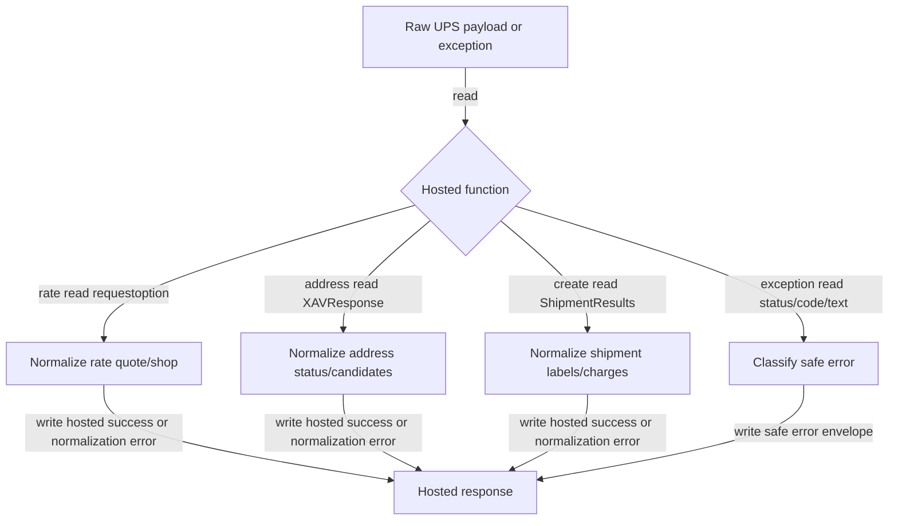

## Responsibility
`ups_mcp/shipagent_normalization.py` is the pure hosted-v1 contract module. It builds the read-only ShipAgent capabilities response, normalizes hosted UPS successes for rate, address validation, and create shipment, and maps raw `ToolError` or transport failures into safe public error envelopes.

The module is intentionally separate from raw UPS behavior. It exposes camelCase hosted success fields, closed error shapes, strict label-data filtering, safe address candidates, and non-leaky error categories. Hosted preflight decisions such as unsupported address countries and idempotency validation are made in `ups_mcp/server.py`, then this module normalizes or classifies the results.

Primary evidence: `ups_mcp/shipagent_normalization.py`, hosted branches in `ups_mcp/server.py`, `tests/test_shipagent_normalization.py`, and `tests/test_shipagent_server_hosted.py`.

## Read Variables
- Contract constants: `HOSTED_CONTRACT_VERSION`, `HOSTED_RESPONSE_FORMAT`, `RAW_RESPONSE_FORMAT`, `SHIPAGENT_CAPABILITIES`, `SUPPORTED_CREATE_LABEL_FORMATS`.
- Raw UPS payload envelopes: `RateResponse.RatedShipment`, `XAVResponse`, and `ShipmentResponse.ShipmentResults`.
- Hosted inputs: `requestoption`, `correlation_id`, and `idempotency_key`.
- UPS charge fields: `TotalCharges`, `NegotiatedRateCharges.TotalCharge`, and `ShipmentCharges.TotalCharges`.
- Address candidate fields: `AddressLine`, `PoliticalDivision2`, `PoliticalDivision1`, `PostcodePrimaryLow`, `PostcodeExtendedLow`, `CountryCode`.
- Shipment package fields: `TrackingNumber`, `ShippingLabel.ImageFormat.Code`, `ShippingLabel.GraphicImage`.
- Exception text and parsed JSON fields such as `status_code`, `statusCode`, `code`, `errorCode`, `message`, `error`, and `detail`.

## Write Variables
- Capability metadata with `contract_version`, `server_version`, `capabilities`, and `response_formats`.
- Hosted rate quote results with `serviceCode`, optional `serviceDescription`, `totalCharges`, and `correlationId`.
- Hosted rate shop results with `ratedShipments`.
- Hosted address results with `status` and safe `candidates`.
- Hosted create-shipment results with `idempotencyKey`, `shipmentIdentificationNumber`, `trackingNumbers`, `totalCharges`, and filtered `labelData`.
- Hosted normalization errors with `UPS_NORMALIZATION_ERROR`.
- Safe error envelopes with categories `auth`, `rate_limit`, `validation`, `service_unavailable`, `transport`, `unknown`, or `normalization`.

## Conditional Loops
- `normalize_rate_result()` branches between quote options (`Rate`, `Ratetimeintransit`) and shop options (`Shop`, `Shoptimeintransit`).
- Quote mode requires exactly one normalized `RatedShipment`; shop mode returns every complete option.
- Negotiated rate charges must be complete when present; malformed negotiated pricing does not fall back to standard totals.
- `normalize_address_result()` maps UPS status indicators to `valid`, `ambiguous`, `invalid`, or `unknown`, rejects conflicting indicators, and rejects invalid/unknown responses that include candidates.
- Address candidate normalization accepts object or list payloads and drops only empty candidates; valid/ambiguous responses must have at least one substantive candidate.
- `normalize_create_shipment_result()` accepts single or list `PackageResults`, requires tracking number and label fields for every package, uppercases label format, and accepts only `GIF`, `ZPL`, `EPL`, or `SPL`.
- Base64 label content must be strict, unwrapped, non-empty base64 without ASCII control characters or whitespace.
- `_classify_exception()` maps status codes, raw codes, and validation-looking text to public categories without exposing raw UPS messages.
- `to_safe_error(..., mutating=True)` forces service-unavailable and transport create-shipment failures to `retryable: false`.

## Mermaid (internal flow)

