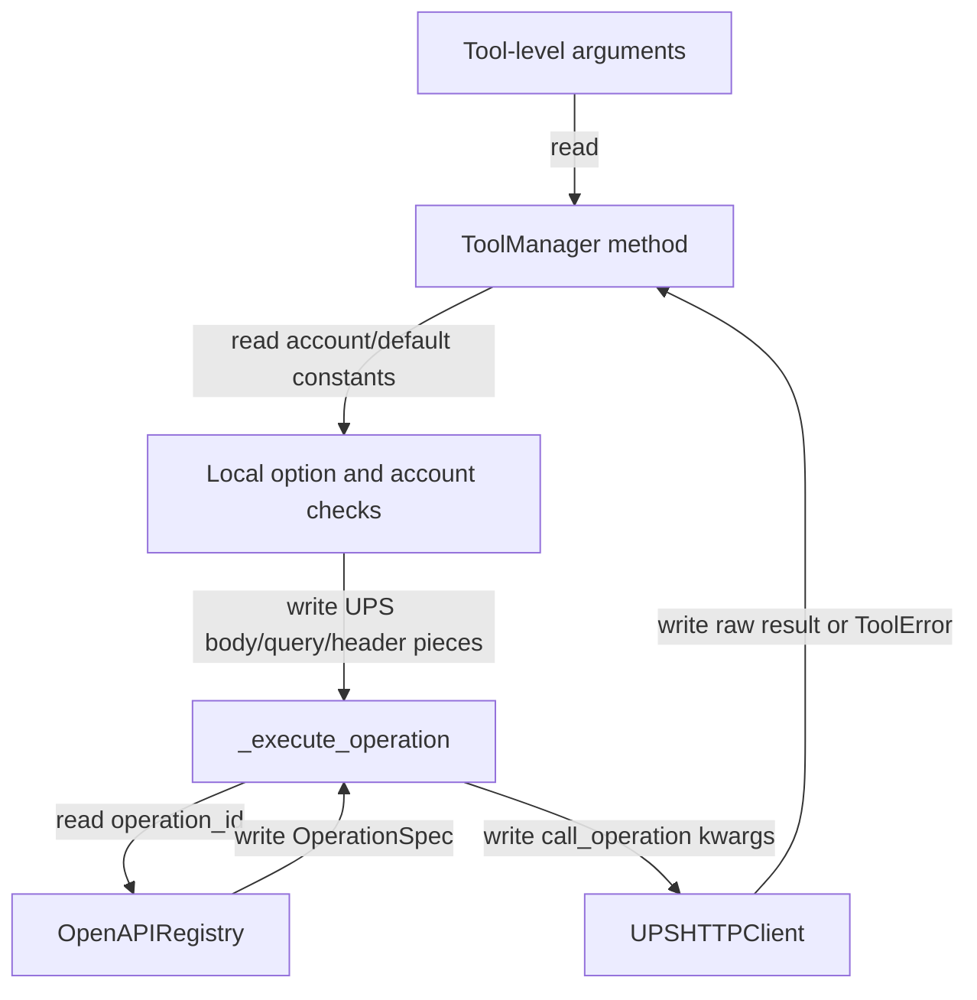

## Responsibility
`ups_mcp/tools.py` contains `ToolManager`, the orchestration layer between MCP tool calls and the transport. It constructs OAuth and HTTP clients, resolves account defaults, maps tool-level inputs to UPS operation IDs, validates small local invariants, assembles UPS request bodies, and calls `UPSHTTPClient.call_operation()`.

This component is responsible for request assembly, not MCP elicitation and not hosted response normalization. It also handles create-shipment idempotency metadata passthrough by copying the caller body and writing the stripped key into `ShipmentRequest.Request.TransactionReference.CustomerContext` when possible.

Primary evidence: `ups_mcp/tools.py`, `ups_mcp/constants.py`, `tests/test_tool_mapping.py`, `tests/test_legacy_tools.py`, `tests/test_landed_cost_tools.py`, `tests/test_paperless_tools.py`, `tests/test_locator_tools.py`, and `tests/test_pickup_tools.py`.

## Read Variables
- Constructor inputs: `base_url`, `client_id`, `client_secret`, optional `account_number`, optional `OpenAPIRegistry`.
- Constants: operation IDs, `RATE_REQUEST_OPTIONS`, locator options, pickup cancel options, paperless valid formats.
- Tool arguments for tracking, address validation, rating, shipment creation/voiding, label recovery, time in transit, landed cost, paperless documents, locator, and pickup tools.
- Caller UPS request bodies for raw body tools.
- `idempotency_key` and existing `ShipmentRequest.Request.TransactionReference.CustomerContext`.
- `OperationSpec` entries from the registry.

## Write Variables
- `OAuthManager` and `UPSHTTPClient` instances.
- UPS request body dictionaries for address validation, landed cost, paperless, locator, pickup rate, pickup creation, and service-center lookup.
- `path_params`, `query_params`, `json_body`, `additional_headers`, `trans_id`, and `transaction_src` passed to the HTTP client.
- `TransactionReference.CustomerContext` in a deep-copied create-shipment body when idempotency metadata is provided.
- Raw UPS response dictionaries returned from `UPSHTTPClient`.
- `ToolError` values for invalid request options, malformed request bodies, missing accounts, invalid tracking-number types, invalid paperless formats, invalid pickup/locator choices, and deprecated/missing operations.

## Conditional Loops
- `_resolve_account()` chooses explicit account number before the manager's environment-derived account.
- `_require_account()` raises when neither explicit nor default account exists.
- `rate_shipment()` normalizes request options case-insensitively through `RATE_REQUEST_OPTIONS`.
- `_with_idempotency_customer_context()` strips the idempotency key, skips empty keys, sets empty customer context, appends when under 512 characters, and preserves existing context when append would exceed 512.
- `void_shipment()` accepts `trackingnumber` as a string or list of strings and rejects other types.
- `get_landed_cost_quote()` iterates commodities, requiring `price` and `quantity`, and conditionally writes weight fields.
- `upload_paperless_document()` lowercases and validates file format before adding shipper headers.
- `find_locations()` maps `location_type` to UPS request option and conditionally adds `AccessPointSearch` for access-point searches.
- `schedule_pickup()` enforces `ready_time < close_time` and requires an account when `payment_method == "01"`.
- `cancel_pickup()` branches between account cancellation and PRN cancellation.
- `_execute_operation()` rejects deprecated operations, merges default path params, and enforces required request bodies.

## Mermaid (internal flow)

